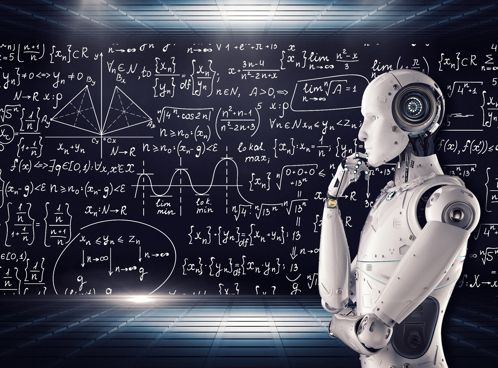

# [Data Science & Machine Learning Enthusiast!](https://williamtwl.wordpress.com/)

___

# Education

* 2022 - Advanced Diploma in Machine Learning, *Ngee Ann Polytechnic*

* 2021 - Specialist Diploma in Data Analytics, *Ngee Ann Polytechnic*

* 2020 - Post-Diploma Certificate In Digital Business Transformation, *Republic Polytechnic*

* 2016 - Master of Business Administration, *The University of Adelaide*

* 2014 - Specialist Diploma in Business Analytics, *Temasek Polytechnic*

* 2014 - Graduate Certificate in Enterprise Resource Planning Systems (SAP ERP), *The University of Victoria*

* 2013 - Certificate of Achievement in Business Intelligence Systems (SAP BI), *The University of Victoria*

* 2013 - Diploma in IT Services (Database Management), *Infocomm Development Authority of Singapore*

* 2002 - Bachelor of Science (Honours) – Applied Accounting (BSc (Hons)), *The University of Oxford Brookes*

* 2001 - The Association of Chartered Certified Accountants, *(ACCA)*

___

# Certifications

* 2020 - Malik Effective Management Program

* 2018 - Microsoft Certified Professional 

* 2018 - Microsoft Certified Solutions Associate: BI Reporting 

* 2011 - i3BAR & Visual Analytics Business Intelligence Dashboards

___

# Technological Toolbox/Skills

* Microsoft Office Suite: Excel, PowerPivot, Power Query, Macro: VBA, Word, PowerPoint, Access, Visio, Project, OneNote

* Microsoft Power BI - DAX

* Microsoft Navision

* Microsoft Dynamics Great Plains

* Python Programming: Pandas, NumPy, Scikit-Learn, SciPy, Statsmodels, Feature Engine, Mlxtend, NLTK, Matplotlib, Seaborn, Plotly, TensorFlow, Keras.

* SAP Web Intelligence (Business Object), SAP Crystal Reports, SAP Dashboard, SAP NetWeaver Business Warehouse, SAP BEx, SAP Enterprise Resource Planning, SAP Business Objects Data Service, SAP Information Design Tool

* SAS Enterprise Guide, SAS Enterprise Miner, SAS Sentimental Analysis Studio

* QlikView

* Tableau 

* SQL

* ACCPAC

* IBM Cognos Planning 

* Google Data Studio

* TIBCO Spotfire

___

# Artificial Intelligence

### Artificial Intelligence (AI) is a science that empowers computers to mimic human intelligence such as decision making, text processing, and visual perception. AI is a broader field that contains several subfield such as machine learning, deep learning, robotics, and computer vision.

# Machine Learning

### Machine Learning is a subfield of Artificial Intelligence that enables machines to improve at a given task with experience. It is important to note that all machine learning techniques are classified as Artificial Intelligence ones. However, not all Artificial Intelligence could count as Machine Learning since some basic Rule-based engines could be classified as AI but they do not learn from experience therefore they do not belong to the machine learning category.

___

# [Click Project 1: Classification & Regression](https://github.com/wiltacca/Portfolio/blob/main/Classification_%26_Regression_Models.ipynb)
   

### Supervised Machine Learning: In Supervised learning, you train the machine using data which is well “labeled.” It means some data is already tagged with the correct answer. It can be compared to learning which takes place in the presence of a supervisor or a teacher.

### Supervised Machine Learning can classify in two types:
### * Classification is the task of predicting a discrete class label.
### * Regression is the task of predicting a continuous quantity.

**CLASSIFICATION -** This project performs HR analytics that is revolutionizing the way human resources departments operate, leading to higher efficiency and better results overall. Human resources have been using analytics for years. However, the collection, processing and analysis of data has been largely manual, and given the nature of human resources dynamics and HR KPIs, the approach has been constraining HR. Here is an opportunity to try machine learning in identifying the employees most likely to get promoted.

* **Python libraries used:** pandas, numpy, sklearn, feature engine, xgboost, math, joblib, scipy, seaborn, matplotlib.
* **Input:** HR dataset contains employee personal information, education background, past performance and more. 
* **Output:** Identified the employees most likely to get promoted.

**REGRESSION -** Airbnb wants to expand on travelling possibilities and present a more unique, personalized way of experiencing the world. Utilize all these features from the dataset to make predictions on the rental price of the listed properties.

* **Python libraries used:** pandas, numpy, sklearn, feature engine, xgboost, math, joblib, scipy, seaborn, matplotlib.
* **Input:** Listing dataset contains the hosts information, the condition of listed properties, the reviews and more. 
* **Output:** Predicted rental price of the listed properties.

___

# [Click Project 2: Clustering & Association Rules](https://github.com/wiltacca/Portfolio/blob/main/Clustering_%26_Association_Rules.ipynb)

### Unsupervised learning is a machine learning technique, where you do not need to supervise the model. Instead, you need to allow the model to work on its own to discover information. It mainly deals with the unlabelled data.

**CLUSTERING -** This project focuses on bank credir risk in particular the customer credit which the bank will gain from giving credit only if the customers will not default on the loan, which means that they will not repay the debt. One of the solutions to address the bank problem is to use hierarchical clustering, which requires creating clusters that have predetermined order from bottom to top using the Agglomerative which is an unsupervised machine learning algorithm uses to cluster unlabeled data points.

* **Python libraries used:** pandas, numpy, sklearn, scipy, wordcloud, plotly, seaborn, matplotlib.
* **Input:** Loaddefault dataset contains customers’ history, such as age, debt ratio, monthly income, number of open credit lines and loans and more.
* **Output:** Discovered a cluster of customers with high credit risk.

**ASSOCIATION RULES -** This project create recommendation systems that are being widely used in all forms of digital platforms; Association rules can be applied in the form of TV Shows recommendation systems to discover the existing relations between features in the database.  By analysing the database, which contains TV shows of distinguishable users, it can find some interesting rules occurring in analysed data.

* **Python libraries used:**  pandas, numpy, sklearn, scipy, mlxtend, plotly, seaborn, matplotlib.
* **Input:** TV Shows dataset contains 9690 record of TV show watched by different customers.
* **Output:** Recommended the next TV show that a customer will be interested in watching. 

___

# Deep Learning

### Deep Learning is a specialized field of Machine Learning that relies on the training of Deep Artificial Neural Networks (ANNs) using a large dataset such as images or texts. ANNs are information processing models inspired by the human brain. The human brain consists of billions of neurons that communicate to each other using electrical and chemical signals and enable humans to see, feel, and make decision. ANNs works by mathematically mimicking the human brain and connecting multiple “artificial” neurons in a multilayered fashion. The more hidden layers added to the network, the deeper the network gets. What differentiates deep learning from machine learning techniques is in their ability to extract features automatically as illustrated in the following example:

### * Machine learning Process: (1) selecting the model to train, (2) manually performing feature extraction.

### * Deep Learning Process: (1) Select the architecture of the network, (2) features are automatically extracted by feeding in the training data (such as images) along with the target class (label).

____

# [Click Project 3: Image Classifications](https://github.com/wiltacca/Portfolio/blob/main/Image_Classifications.ipynb)

### Convolutional Neural Network (CNN) is a class of deep neural networks most commonly used for analysing visual imagery. Convolution layers are the building blocks of CNNs. Convolution is the simple application of a filter to an input that results in activation. Repeated application of the same filter to an input result in a map of activations called a feature map, indicating the locations and strength of a detected feature in input, such as an image. What makes CNN so powerful and useful is that it can generate excellent predictions with minimal image preprocessing. Also, CNN is immune to spatial variance and can detect features anywhere in the input images.

### VGG16 is a CNN architecture which was used to win ILSVR (Imagenet) competition in 2014. It is considered to be one of the excellent vision model architectures to date. The most unique thing about VGG16 is that instead of having a large number of hyper-parameters they focused on having convolution layers of 3x3 filter with a stride 1 and always used the same padding and maxpool layer of 2x2 filter of stride 2. It follows this arrangement of convolution and max pool layers consistently throughout the whole architecture. In the end it has 2 FC (fully connected layers) followed by a softmax for output. The 16 in VGG16 refers to it has 16 layers that have weights. This network is a pretty large network and it has about 138 million (approx) parameters.

**IMAGE CLASSIFICATIONS -** This project focuses on building various multiclass image classification models to recognise and classify ten different types of food.

* **Python libraries used:** pandas, numpy, tensorflow, keras, os, time, matplotlib.
* **Input:** Images of baby back ribs, bibimbap, cupcakes, dumplings, fried calamari, garlic bread, lasagna, pancakes, prime rib, and tiramisu.
* **Output:** Accurately classified the ten different types of food correctly.

___

# [Click Project 4: Sentiment Analysis](https://github.com/wiltacca/Portfolio/blob/main/Sentiment_Analysis.ipynb)

### Recurrent Neural Network (RNN) processes sequences by iterating through the sequence elements and maintaining a state containing information relative to what it has seen so far. In effect, an RNN is a type of neural network that has an internal loop. The state of the RNN is reset between processing two different, independent sequences so still consider one sequence a single data point: a single input to the network. What changes is that this data point is no longer processed in a single step; rather, the network internally loops over sequence elements.

### Long Short-Term Memory (LSTM) was created as the solution to short-term memory caused by RNN. It has internal mechanisms called gates that can regulate the flow of information. An LSTM has a similar control flow as a recurrent neural network. It processes data passing on information as it propagates forward. The differences are the operations within the LSTM’s cells.

### GRU is the newer generation of Recurrent Neural networks and is pretty similar to an LSTM. GRU’s got rid of the cell state and used the hidden state to transfer information to solve the vanishing gradient problem which comes with a standard recurrent neural network. It also only has two gates, a reset gate and an update gate.

### GloVe (Global Vectors for Word Representation) is an unsupervised learning algorithm for obtaining vector representations for words developed by Stanford researchers in 2014. Training is performed on aggregated global word-word co-occurrence statistics from a corpus, and the resulting representations showcase interesting linear substructures of the word vector space.

**SENTIMENT ANALYSIS -** This project focuses on building a sentiment analysis model to predict Disney Plus Disney Plus App review scores based on Google Play Store reviews.

* **Python libraries used:** pandas, numpy, tensorflow, keras, os, time, string, emoji, nltk, matplotlib.
* **Input:** Scraped the most recent reviews from com.disney.disneyplus (in Google Play Store) in the English language from United State.
* **Output:** Accurately predict user input review scores correctly.

___

# [Click Project 5: Feature Engineering](https://github.com/wiltacca/Portfolio/blob/main/Feature_Engineering.ipynb)

### Feature engineering is a machine learning technique that leverages data to create new variables that aren't in the training set. It can produce new features for both supervised and unsupervised learning, with the goal of simplifying and speeding up data transformations while also enhancing model accuracy.

**FEATURE ENGINEERING -** This project focuses on wrangling the data from the three different baseball datasets to understand various data wrangling techniques such as joining the tables and exploring, preparing, and transforming data through multiple methods. Once the data has been transformed and is ready for modelling, proceed to build regression and classification models.

* **Python libraries used:** pandas, numpy, sklearn, feature engine, datetime, scipy, seaborn, matplotlib.
* **Input:** Three baseball datasets extracted from a database contains players' awards, batting, hall of fame information.
* **Output:** Build two simple machine learning models (regression and classification) based on the wrangled and prepared data.

___

# [Click Project 6: Data Visualization](https://github.com/wiltacca/Portfolio/blob/main/Data_Visualisation.ipynb)

### The process of finding trends and correlations in our data by representing it pictorially is called Data Visualization. To perform data visualization in python, we can use various python data visualization modules such as Matplotlib, Seaborn, Plotly, etc. In the world of Big Data, data visualization tools and technologies are essential to analyze massive amounts of information and make data-driven decisions.

**DATA VISUALIZATION -** This project focuses on assuming that you are part of the market research team for Cardio Good Fitness, a retail business specializing in the sales of treadmills. The team has collected data on individuals who purchased a treadmill at the Cardio Good Fitness retail stores for the past three months.
Through data preparation, exploration and visualisation, the market research team decides to investigate whether there are differences across the product lines with respect to customer characteristics.

* **Python libraries used:** pandas, numpy, scipy, plotly, seaborn, matplotlib, bokeh.
* **Input:** cardio dataset contains products, branches, genders, ages, educations of customers, model of treadmills and more.
* **Output:** Discovered vast differences across various product lines with respect to customer characteristics.

___

# Data Science

### The ultimate goal of data science is to solve problems by extracting knowledge from data and giving support for complex decisions. The first part of solving a problem is getting a good understanding of its domain. You need to understand the insurance business before using data science for risk analysis. You need to know the details of the goods manufacturing process before designing an automated quality assurance process. First, you understand the domain. Then, you find a problem. If you skip this part, you have a good chance of solving the wrong problem. After coming up with a good problem definition, you seek a solution. 

___

# [Click Project 7: Statistics](https://github.com/wiltacca/Portfolio/blob/main/Statistics.ipynb)

### Statistics, in general, is the method of collection of data, tabulation, and interpretation of numerical data. It is an area of applied mathematics concerned with data collection analysis, interpretation, and presentation. With statistics, we can see how data can be used to solve complex problems. 

**STATISTICAL TESTS -** This project focuses on answering six questions about the students’ performance. Using the appropriate data from the dataset provided, perform statistical techniques to provide answers to these questions.

* **Python libraries used:** pandas, numpy, sklearn, feature engine, sweetviz, scipy, statsmodels, seaborn, matplotlib, pylab.
* **Input:** Student grades dataset contains student marks for four different modules (Math, Science, Comms, Tech) from five different diplomas (Dip_Technology, Dip_Media, Dip_Security, Dip_Social, Dip_Banking) and more.
* **Output:** Answered these questions by applying various statistical techniques.

___

# [Click Project 8: Python Programming](https://github.com/wiltacca/Portfolio/blob/main/HDB_Resale_Pricing_Financial_Evaluation_System.ipynb)
 

### Python is an open-sourcing programming language. Therefore, it is freely available for everyone to access, download, and execute. There are no licensing costs involved with Python. Companies can save money by working with Python. The open-source nature of Python also ensures that developers can update the programming language and make modifications. But there are costs involved in using Python for app development. They may not be the licensing costs but the price of hiring a programmer, paying the development partner, and maintaining the app.Python programming language has a syntax similar to the English language, making it extremely easy and simple for anyone to read and understand its codes. You can pick up this language without much trouble and learn it easily. This is one of the reasons why Python is better compared to other programming languages such as C, C++, or Java.

**PYTHON PROGRAMMING -** This project aims to address Part (A) requirement that is to compute the correlation coefficient between the HDB Resale Price Index (RPI) and Singapore’s population from 1990 to 2019. Part (B) requirements are to develop a system with the main menu to allow users to input the basic savings, savings with pay raise, choice of HDB flat to buy, most expensive flats per sqm and exit from the system.

* **Python libraries used:** pandas, numpy.
* **Input:** Past HDB transacted dataset contains historical HDB resale flats information.
* **Output:** Established solutions to address Part (A) and (B) requirements. 
